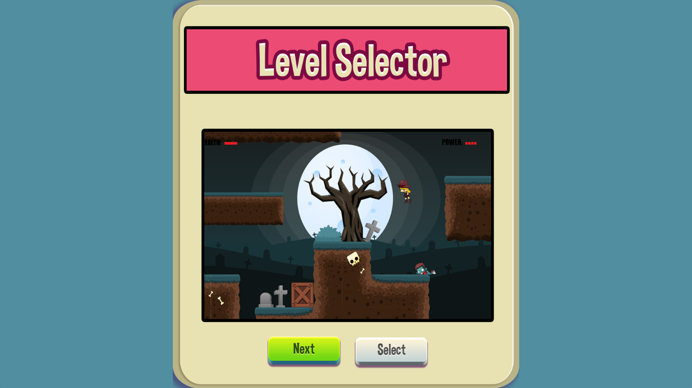
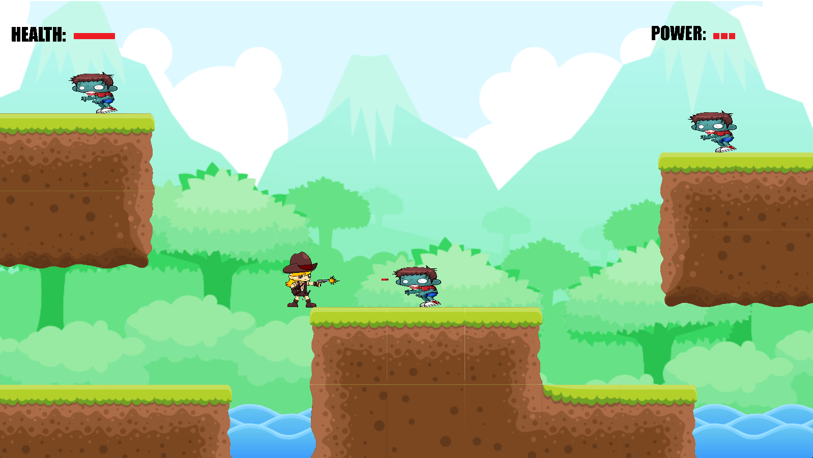
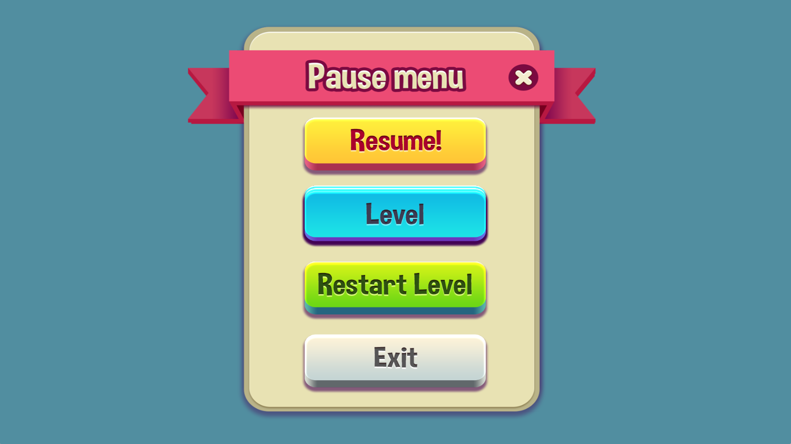
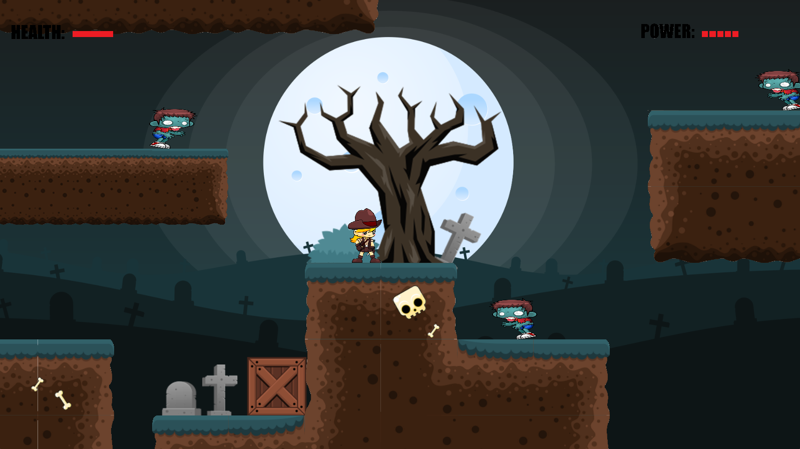

### Data Structures Game

This is a simple but complete 2D platformer game created as a part of "Data Structures" course. The course was offered in the second semester at IIT Bhilai, and the project took almost 3 months to build completely from scratch.

The game has two levels and to finish a level you must kill all the zombies without dying. You can restart any level at any point and/or select any level at will. The keybindings for the game is as follows:

- `a` - Left
- `d` - Right
- `space` - Jump
- `space (hold)` - fly
- `mouse left` - shoot
- `escape` - pause menu

Some features of the game:

- Build completely from scratch using LWJGL2 library which provide OpenGL binding for Java and helper classes like math and audio.
- Custom GUI handler which uses linked list to iterate through the GUI nodes and process them accordingly.
- Custom collision detector and handler.
- Audio using OpenAL.
- Font rendering using font texture atlas.

I created the game really early when I started programming and because of that the architecture of the project is not that great. Although the game does have some level of abstraction between the game itself and the game engine component, the code cannot be used to build any other game. The collision detection and response code is mingled with other components such as audio and rendering. Another issue is that the positions for entities are in screen space, so resizing the window messes up the layout.

Apart from the technical errors, it is a complete game and can be played till completion.

#### To run the project follow the steps:

The project was tested and built using IntelliJ Idea under the Windows operating system. It has not been tested on any other system and may require changes to the `lwjgl` library since the included one is for Windows only. The project has only two dependencies i.e., LWJGL2 (lightweight java game library), and the Slick Utils library. Both are included in the `lib` folder and can be used to build under Windows. The LWJGL2 library require JDK version 14 or below to run because of some internal dependencies, so you must build the project using JDK version 14 otherwise it will throw exceptions.

##### To Build the project

- Clone the repository.
  ```git
  git clone https://github.com/anujv99/DataStructuresGame
  ```
- Now open the cloned folder using IntelliJ Idea and add the `lwjgl`, `lwjgl_util` and `slick-util` to the project structure as additional libraries. Also add all the dlls in the `lib/natives` folder similar to the jars.

- Once done, edit the configurations and use JDK version 14 to build the project and use `MainGameLoop` as the entry point. If everything works fine you should see the game running.

-  Note: If you do not want to use IntelliJ Idea for any reason then the basic gist of building is to link the libraries in the `lib/jar` and `lib/natives` folder and use JDK version 14 to build and run the project.

#### Gameplay

The recorded gameplay can be viewed at: [link](https://www.youtube.com/watch?v=2hd3ng6bd7g)

[](https://www.youtube.com/watch?v=2hd3ng6bd7g)

#### Screenshots







